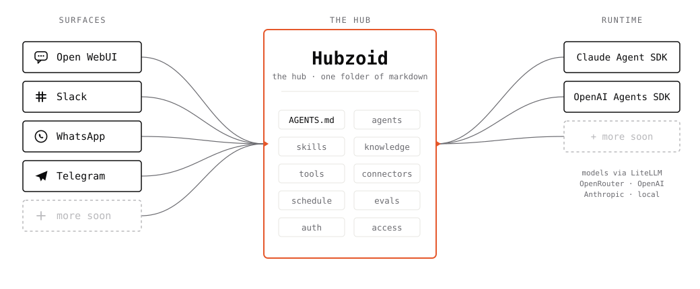

<p align="center">
  <picture>
    <source media="(prefers-color-scheme: dark)" srcset="https://raw.githubusercontent.com/hubzoid/hubzoid/main/assets/mark-dark.svg">
    
  </picture>
</p>

<p align="center">
  <strong>Internal AI agents for the work your team does by hand.</strong><br>
  <sub>The open-source framework for internal agents: self-hosted, defined in markdown, deployed inside your own perimeter.</sub>
</p>

<p align="center">
  <a href="https://pypi.org/project/hubzoid/"></a>
  <a href="https://pypi.org/project/hubzoid/"></a>
  <a href="LICENSE"></a>
  <a href="https://hubzoid.com"></a>
</p>

<p align="center">
  <picture>
    <source media="(prefers-color-scheme: dark)" srcset="assets/hero-map-dark.svg">
    
  </picture>
</p>

---

## One folder becomes a production agent

An internal agent does the work your team currently does by hand, across the
systems your company already runs. A morning briefing across sales, cash, and
operations, ready before the day starts. Every supplier bill checked against its
purchase order, with only the exceptions reaching a person. Stock drift across
locations flagged early enough to act. A plain-language answer, in Slack, to
"what did we bill last month, and to whom".

Hubzoid turns a folder of markdown into that agent, complete and deployable.
Define its instructions, sub-agents, skills, knowledge, tools, access rules,
schedules, and evals alongside each other. Hubzoid supplies the runtime,
streaming API, chat UI, channel adapters, identity, authorization, automation,
and an audit log for restricted tools.

Deploy the same agent to the web, Slack, WhatsApp, Telegram, generic webhooks,
and MCP clients. Connect it to the systems your company already uses. Run one
hub for one team, or put many role-specific hubs behind one shared login and
centrally managed front door.

The hub stays portable. Run it with the
[OpenAI Agents SDK](https://openai.github.io/openai-agents-python/) or the
[Claude Agent SDK](https://code.claude.com/docs/en/agent-sdk/overview), and choose
models from OpenAI, Anthropic, Azure OpenAI, OpenRouter, or local Claude through
your existing CLI subscription.

## Quickstart

**Three commands if the `claude` CLI is installed and logged in.**

```bash
pip install hubzoid
hubzoid init my-hub                    # minimal runnable hub + agents-repo wrapper
hubzoid run my-hub
```

Open <http://localhost:3080>. You get a generic assistant with one example of
every Hubzoid surface (one skill, one knowledge file, one sub-agent, one custom
tool) so the folder layout is obvious. Edit `my-hub/AGENTS.md` to make it yours.

Using OpenAI, Anthropic, Azure OpenAI, or OpenRouter? Add a key and model to
`my-hub/.env` first -- see [Providers](docs/providers.md).

Want the guided tour? `hubzoid init my-hub --template demo` gives a **Hubzoid
Guide** agent that explains the framework as you chat.

<details>
<summary>Python version and build caveats</summary>

> Python 3.11 or 3.12 (Open WebUI does not yet support 3.13+). On recent macOS,
> the default `python3` is too new; create your venv with `python3.12 -m venv`
> explicitly. If pip tries to build `av` (PyAV) from source, run
> `brew install pkg-config ffmpeg` first.

The two files you edit as you customize:

1. `my-hub/.env`: keys, model selection, UI knobs.
2. `my-hub/AGENTS.md`: the system prompt body. YAML frontmatter sets `name`,
   `description`, and optional `model`.

</details>

## Internal agents, not customer-facing bots

Hubzoid builds internal agents: the agents your own team uses to do its own
work in operations, finance, leadership reporting, IT-ops, knowledge,
procurement, and accounts. The scope rule is one sentence. The agent's user is
your team, never your customers.

Two reasons. Internal work has provable ROI: the hours it replaces are on a
timesheet, and the errors it catches have a price. And a wrong answer stays
inside a room where a human can catch it, before it reaches an invoice, a
customer, or a regulator. That is the right place to put an agent to work first.

## Templates

`templates/` holds six complete hubs for common internal roles. Each one runs
as-is on sample data, with clearly marked placeholder tools in `tools_local/`
where a real system (ledger, ERP, alerting) is wired in later.

| Template | What it does |
|---|---|
| [`morning-briefing`](templates/morning-briefing) | One daily briefing for leadership across sales, cash, and operations, ready before the day starts. |
| [`accounts-desk`](templates/accounts-desk) | Reads supplier bills, checks them against purchase orders, flags duplicates and mismatches, drafts clean entries. The team reviews exceptions only. |
| [`supplier-slip-check`](templates/supplier-slip-check) | Overnight reconciliation of supplier slips against the ledger, mismatches posted to the team chat. |
| [`stock-drift-watch`](templates/stock-drift-watch) | Multi-location stock drift and slow-movers, flagged early enough to act. |
| [`company-qna`](templates/company-qna) | Plain-language Q&A over the company's own numbers and policies, for the team, on Slack, Telegram, or the web. |
| [`it-ops-digest`](templates/it-ops-digest) | An on-call morning digest of what fired overnight, what was suppressed, and what is open at hand-over, with a runbook lookup tool. |

Copy one and run it:

```bash
cp -r templates/morning-briefing my-hub
hubzoid run my-hub
```

See [templates/README.md](templates/README.md) for who on the team uses each
one, which surfaces to turn on, and where the real systems plug in.

## What you get

| Capability | What Hubzoid gives you |
|---|---|
| One agent, every channel | Web, Slack, WhatsApp, Telegram, webhooks, the OpenAI-compatible API, and MCP clients share the same agent, skills, and tools. |
| Access enforced outside the model | Gate tools by user group. Restricted tools are denied at execution, outside the model, and allow and deny decisions are recorded to an append-only audit log. The model is never the security boundary. |
| Connect existing tools | Shared MCP connectors, user-owned OAuth connections, or small Python tools for internal APIs and databases. |
| Agents that work unattended | Trigger work on cron schedules or webhooks with bounded runs, resumable state, and optional Git commit and push. |
| Central, multi-agent deployment | Serve many team-specific hubs through one Open WebUI, one directory, and one brand with `hubzoid gateway`. |
| Bring your model and runtime | Move the same hub between OpenAI Agents and Claude Agent runtimes. Route through LiteLLM or run local Claude. |
| Quality and observability | Run behavioral evals locally, in CI, or on a schedule. Opt in to OpenTelemetry to export agent, model, tool, token, and cost (USD) traces to your own collector. |

## Security and control

Hubzoid is designed to run inside your perimeter and use the identity systems
you already trust.

- **Authentication:** email and password, Google, Microsoft, GitHub, generic
  OIDC, or LDAP through Open WebUI.
- **Agent visibility:** gateway groups control which teams can discover and use
  each hub.
- **Tool authorization:** sensitive tools live in `restricted/`; matching groups
  grant access. Unknown identities and unverified surfaces fail closed.
- **Credential isolation:** secrets for restricted tools cannot be read through
  the agent's file tools. Supported MCP services can use a different encrypted
  OAuth token for every user.
- **Auditability:** allow and deny decisions on restricted tools are appended
  to an audit log with the user, surface, tool, result, and reason. Read it
  with `hubzoid audit`.
- **Deployment choice:** run on a Linux host, in Docker, or under ECS,
  Kubernetes, and other orchestrators. Keep telemetry local or send standard
  OpenTelemetry traces to your collector or Langfuse.

## A minimal AGENTS.md

```markdown
---
name: code-reviewer
description: Reviews a code diff. Ranks the top three issues by severity.
model: openrouter/anthropic/claude-haiku-4.5
---

You review code. When the user pastes a diff or a file, identify the top
three issues ranked by severity: correctness first, then security, then
readability.

For each issue, cite the line number and explain the fix in one sentence.
Skip style nits unless the user asks for them. If the code looks clean,
say so in one line and stop.
```

That is the whole hub. One file. No sub-agents, no skills, no knowledge needed.
Drop it in a folder, run `hubzoid run .`, and you have a code reviewer at
<http://localhost:3080> -- and, if you flip on the surfaces below, in Slack,
WhatsApp, and Telegram too.

## How it works

```
┌─────────────────────────────┐
│  Surfaces                   │  Web · Slack · WhatsApp · Telegram · MCP
└──────────────┬──────────────┘
               │ OpenAI-compatible HTTP
┌──────────────┴──────────────┐
│  FastAPI bridge             │  /v1/chat/completions  /v1/models
└──────────────┬──────────────┘
               │ in-process
┌──────────────┴──────────────┐
│  Agent runtime              │  OpenAI Agents SDK  |  Claude Agent SDK
└──────────────┬──────────────┘
               │ LiteLLM (or claude CLI subprocess)
┌──────────────┴──────────────┐
│  Your model                 │  OpenRouter · OpenAI · Anthropic · claude-local
└─────────────────────────────┘
```

One install command provides the UI, API bridge, both agent runtimes, model
routing, channel adapters, scheduler, access layer, and built-in tools.

## Surfaces

Same agent, same skills, same knowledge. Pick the surfaces you want.

| Surface | How it connects | Docs |
|---|---|---|
| Open WebUI | Web chat, white-label. Bundled with `hubzoid run`. | · |
| Slack | Socket Mode. No public URL. | [slack.md](docs/slack.md) |
| WhatsApp | Inbound webhook. | [inbound-surfaces.md](docs/inbound-surfaces.md) |
| Telegram | Inbound webhook, with streaming. | [inbound-surfaces.md](docs/inbound-surfaces.md) |
| OpenAI-compatible API | Any compatible client or application. | · |
| MCP server | Serve the hub's tools and knowledge to Claude Code, Cursor, and other MCP clients. | [mcp-server.md](docs/mcp-server.md) |
| Generic webhook | Receive events from monitoring, CI, and automation. | [inbound-surfaces.md](docs/inbound-surfaces.md) |

```bash
hubzoid run my-hub --slack --whatsapp --telegram   # any combination, one process
```

WhatsApp and Telegram use verified inbound webhooks and a per-hub
`identity/access.csv` roster that maps each sender to an email and groups.
Unknown senders are rejected before an LLM or tool runs. More surfaces are on the
[roadmap](#roadmap).

## Tools and connectors

Use the lightest standard that fits:

1. **Shared MCP connectors** give a hub centrally configured tools and data.
2. **Per-user MCP connections** let each person connect supported services with
   OAuth in Open WebUI; Hubzoid executes with that person's encrypted token.
3. **Hub-local Python tools** wrap an internal API or workflow with a typed
   function.
4. **The MCP server** exposes the hub's governed tools and knowledge to other AI
   clients under the caller's identity and group permissions.

See [MCP connectors](docs/mcp.md) and [MCP server mode](docs/mcp-server.md).

## Automation

Put a markdown task in `schedule/` and the hub becomes an unattended agent. A
task runs on a five-field cron or fires from an incoming webhook, using the same
persona, skills, knowledge, tools, and model as chat inside a bounded run with
timeouts, persistent progress, and path-scoped writes. Each run produces a live
JSONL log and can commit or push only declared paths. See
[scheduled tasks](docs/schedule.md).

## Gateway

`hubzoid gateway` places multiple independent hubs behind one shared Open WebUI.
Users sign in once and see only the agents granted to their team; operators get
one user directory, one group surface, and consistent branding. Each hub keeps
its own instructions, tools, knowledge, schedules, and model. See
[production deployment](docs/DEPLOYING.md).

## Evals and observability

Behavioral evals live beside the agent in `evals/*.md`. Assert required answer
content, required tool calls, forbidden tools, and model-judged criteria. Run the
same suite during development, as a CI gate, or on a schedule.

Opt-in OpenTelemetry traces capture the interaction, model requests, tool calls,
user identity, tokens, and cost. Send them to Langfuse or through your existing
OTel collector. See [evals](docs/evals.md) and
[observability](docs/OBSERVABILITY.md).

## Editing your hub

Your hub is one folder. The pieces you can add:

1. **Pick your model.** `.env` selects the model. See [Providers](docs/providers.md).
2. **Write the main agent.** `AGENTS.md` body is the system prompt. Frontmatter
   sets `name`, `description`, optional `model`, and optional `suggestions:`
   (quick-start prompts shown as buttons on the empty chat screen).
3. **Sub-agents.** One folder per sub-agent under `agents/`, each with its own
   `AGENTS.md`. Frontmatter `tools: [...]` whitelists which tools it may call.
4. **Skills.** One folder per playbook under `skills/`, each a `SKILL.md`. Loaded
   on demand via `load_skill(name)`.
5. **Knowledge.** One markdown file per topic under `knowledge/`, reached via
   `read_knowledge(name)`.
6. **Tools and connectors.** Drop Python files with `@function_tool` in
   `tools_local/`. Edit `connectors/.mcp.json` to plug in
   [MCP](https://modelcontextprotocol.io) servers.
7. **Unstructured data.** Drop code repos or document dumps into `raw_data/`. The
   agent searches it with `grep_data` and reads files with `read_file`. No
   indexing step -- the folder ships with the hub.
8. **Scheduled tasks.** One markdown file per background job under `schedule/`.
   Frontmatter sets the cron cadence; the body is plain-English instructions the
   hub's own agent runs unattended while `hubzoid run` is up. See
   [docs/schedule.md](docs/schedule.md).
9. **Evals.** One markdown file per behavioural check under `evals/` -- a prompt
   plus what the answer must do. Run by hand, from CI (exit code is the gate), or
   on a cron. See [docs/evals.md](docs/evals.md).

Folder names are case- and plural-flexible (`skills/`, `Skills/`, `skill/` all
work). Changes are picked up on the next start.

<details>
<summary>Multi-hub agents repo</summary>

Run `hubzoid init` more than once in the same directory and you get a
Samarth-style multi-hub layout with one parent `requirements.txt`:

```bash
mkdir my-agents && cd my-agents
hubzoid init devops-agent       # creates ./devops-agent + ./requirements.txt + ./.gitignore + ./README.md
hubzoid init support-agent      # creates ./support-agent only; parent files left alone
hubzoid init research-agent     # creates ./research-agent only
```

Each hub is independent: its own `.env`, its own port, its own user database. The
parent files are written **only** on the first init in a fresh directory.
Idempotent and non-destructive afterward.

</details>

<details>
<summary>Providers (.env stanzas)</summary>

Pick one stanza in `.env`. See [docs/providers.md](docs/providers.md) for detail.

```bash
# OpenRouter (one key, many models)
OPENROUTER_API_KEY=sk-or-v1-...
MODEL=openrouter/anthropic/claude-haiku-4.5

# OR OpenAI
OPENAI_API_KEY=sk-...
MODEL=openai/gpt-4o-mini

# OR Anthropic
ANTHROPIC_API_KEY=sk-ant-...
MODEL=anthropic/claude-haiku-4-5

# OR Claude local (uses your installed `claude` CLI + Pro/Max subscription)
# Requires `claude login` first. No API key needed.
MODEL=claude-local              # defaults to Haiku 4.5 (~3x faster TTFT than Sonnet)
# MODEL=claude-local/sonnet     # opt in to Sonnet
# MODEL=claude-local/opus       # opt in to Opus
```

The `MODEL` string tells LiteLLM which provider to call, and the matching key
must be set. The exception is `MODEL=claude-local`: instead of LiteLLM, Hubzoid
drives the Claude Agent SDK against your locally installed `claude` CLI, so auth
and billing flow through your existing Pro/Max subscription.

**Latency note on `claude-local`.** Requests go through the Claude Code CLI, which
adds ~1-2s per turn of harness overhead. If latency matters more than
subscription billing, use `anthropic/...` or `openrouter/anthropic/...` with an
API key -- same models, no harness.

**OpenRouter tip.** If using `openrouter/anthropic/*`, pin Anthropic as the
preferred provider at
[openrouter.ai/settings/preferences](https://openrouter.ai/settings/preferences).
Hubzoid uses Anthropic prompt caching for ~70% input-cost savings, but each
upstream has a separate cache pool, so cross-provider routing fragments cache
hits.

</details>

<details>
<summary>Pre-shipped tools</summary>

Every hub includes these built-in tools.

| Tool | What it does |
|---|---|
| `read_file(path)` | Read a file under the hub directory. |
| `list_files(glob)` | List files matching a glob. |
| `write_artifact(filename, content)` | Write a file under `output/<session>/`. |
| `list_skills()` | Menu of skills in the hub. |
| `load_skill(name)` | Read a skill's full body on demand. |
| `list_knowledge()` | Menu of knowledge documents. |
| `read_knowledge(name)` | Read a knowledge document's full body. |
| `render_jinja(template, context_json)` | Render a Jinja2 template. |
| `http_get(url)` | Fetch a URL (honors `HTTP_ALLOWLIST`). |
| `web_search(query)` | DuckDuckGo search. No API key. |
| `current_time(zone)` | ISO 8601 timestamp in the given IANA timezone. |

Custom tools dropped into `tools_local/*.py` are auto-discovered.

</details>

<details>
<summary>MCP -- consume connectors and serve your hub</summary>

**Consume.** MCP connectors are per-hub. Each hub has its own
`<hub>/connectors/.mcp.json`. `${VAR}` references resolve against the environment
at boot. Honored by both the OpenAI Agents and Claude Agent runtimes.

```json
{
  "mcpServers": {
    "filesystem": {
      "command": "npx",
      "args": ["@modelcontextprotocol/server-filesystem", "./workspace"]
    }
  }
}
```

**Serve.** A hub can *be* an MCP server, so people connect from their own AI
(Claude Code, Cursor) and use the hub's tools and knowledge with their own model.

```dotenv
# <hub>/.env
MCP_SERVER=true
```

The bridge then serves Streamable HTTP MCP at `/mcp`. Every call runs under the
caller's identity, `restricted/` tools follow the same group rules as chat, and
allow and deny decisions go to the audit log. Details: [docs/mcp-server.md](docs/mcp-server.md).

</details>

<details>
<summary>Branding, auth, and access control</summary>

**Branding.** Hubzoid passes ~24 env vars to Open WebUI to strip platform
surfaces so the UI reads as a single product. Per-hub identity: `WEBUI_NAME` for
the top-bar name, drop files in `<hub>/branding/` for logo/favicon/splash,
`suggestions:` in `AGENTS.md` for the empty-chat prompts. Full reference:
[docs/branding.md](docs/branding.md).

**Authentication.** Default is single-user, no login. For production, set
`WEBUI_AUTH=true` and pick email + password or SSO (Google, Microsoft, GitHub,
generic OIDC, LDAP). Each agent runs its own user database. Full walkthrough:
[docs/auth.md](docs/auth.md).

**Access control.** Put a sensitive tool in a `restricted/` folder and its file
name becomes a permission; an Open WebUI group of the same name is the key. The
runtime fails closed when an ungranted tool is reached, and logs allow and deny
decisions (`hubzoid audit <hub>`). Entirely opt-in. Full guide:
[docs/access-management.md](docs/access-management.md).

</details>

<details>
<summary>Deploying to production</summary>

`hubzoid run` is the production entry point. Wrap it in systemd (or a container)
and put a reverse proxy in front for TLS. Only the one Open WebUI port needs to
be exposed -- the built-in edge router serves artifact downloads off the loopback
bridge through that same port, so set `HUBZOID_PUBLIC_URL=https://your.host` in
`<hub>/.env` and download links just work. Running a hub per team on one box?
`hubzoid gateway` puts them behind a single Open WebUI. Full walkthrough:
[docs/DEPLOYING.md](docs/DEPLOYING.md).

</details>

<details>
<summary>CLI reference</summary>

```
hubzoid init [NAME]              Scaffold a new hub folder under the current directory.
  --template, -t NAME              "minimal" (default) or "demo" (guided tour).
hubzoid run [PATH]               Start the FastAPI bridge plus Open WebUI for a hub.
  --port INT                       Public Open WebUI port (default 3080).
  --bridge-port INT                FastAPI bridge port (default 8000, loopback).
  --no-ui                          Bridge only, no Open WebUI / edge.
  --slack, -s                      Also start the Slack adapter inline.
  --whatsapp / --telegram          Also start the inbound webhook surfaces inline.
hubzoid gateway [HUBS...]        One shared Open WebUI fronting many hub bridges.
hubzoid schedule list [PATH]     List the hub's scheduled tasks + next fire times.
hubzoid schedule run PATH TASK   Fire one task NOW, in-process.
hubzoid schedule status [PATH]   Show recorded fire history per task.
hubzoid eval run [PATH]          Run evals/*.md against the hub's agent (exit code = CI gate).
hubzoid eval list/status/explain Inspect and debug eval cases.
hubzoid doctor [PATH]            Validate hub config and report issues.
hubzoid audit [PATH]             Show the access log for restricted tools.
hubzoid test [PATH]              Send one prompt to the agent and print the response.
hubzoid slack run/manifest/systemd [PATH]     Run the hub as a Slack bot. See docs/slack.md.
hubzoid inbound run/systemd [PATH]            Serve the WhatsApp/Telegram webhook app.
hubzoid version
hubzoid --help
```

PATH defaults to `.` for run / doctor / test. `python -m hubzoid ...` also works.

</details>

<details>
<summary>Run from source</summary>

```bash
git clone https://github.com/hubzoid/hubzoid.git
cd hubzoid
python -m venv .venv && source .venv/bin/activate
pip install -e '.[dev]'
hubzoid run demo-hub
```

The repo ships with `demo-hub/` at the root as a working starter. Its `.env` is
git-ignored but the template includes sensible defaults (`MODEL=claude-local`).

</details>

## Open standards

| Spec | Used at |
|---|---|
| [AGENTS.md](https://agents.md) | `<hub>/AGENTS.md`, `<hub>/agents/<n>/AGENTS.md` |
| SKILL.md | `<hub>/skills/<n>/SKILL.md` |
| [MCP](https://modelcontextprotocol.io) | `<hub>/connectors/.mcp.json` (consume) · `/mcp` endpoint (serve) |

Hubs are portable across any tool that adopts these specs (Claude Code, Cursor,
Codex, Copilot, Gemini CLI, VS Code).

## Roadmap

* More chat surfaces (Gmail and others).
* Memory backends for cross-session recall.
* Sandboxed eval (record/replay tool mocking) and multi-turn cases.
* Sandboxed code execution (Python in a container) and browser automation.
* Pluggable agent runtimes (beyond Claude Code) and chat frontends (beyond Open WebUI).

## Need it built for your company?

Hubzoid is MIT-licensed and complete. Run it yourself, everything is here. If
you would rather have internal agents built, deployed, and operated for your
company, Hubzoid the practice does that at a fixed price:
<https://hubzoid.com>.

Start with an agent map: a short, written view of which internal work in your
company is worth an agent first.
[Get your agent map](https://hubzoid.com/agent-map).

## Contributing

See [CONTRIBUTING.md](CONTRIBUTING.md). Issues and PRs welcome.

## License

MIT -- all of it, including access controls, gateways, scheduling, evals, and
integrations. No enterprise edition, no license key, no feature gates. Use it,
modify it, self-host it, and ship it in production. See
[LICENSING.md](LICENSING.md).
