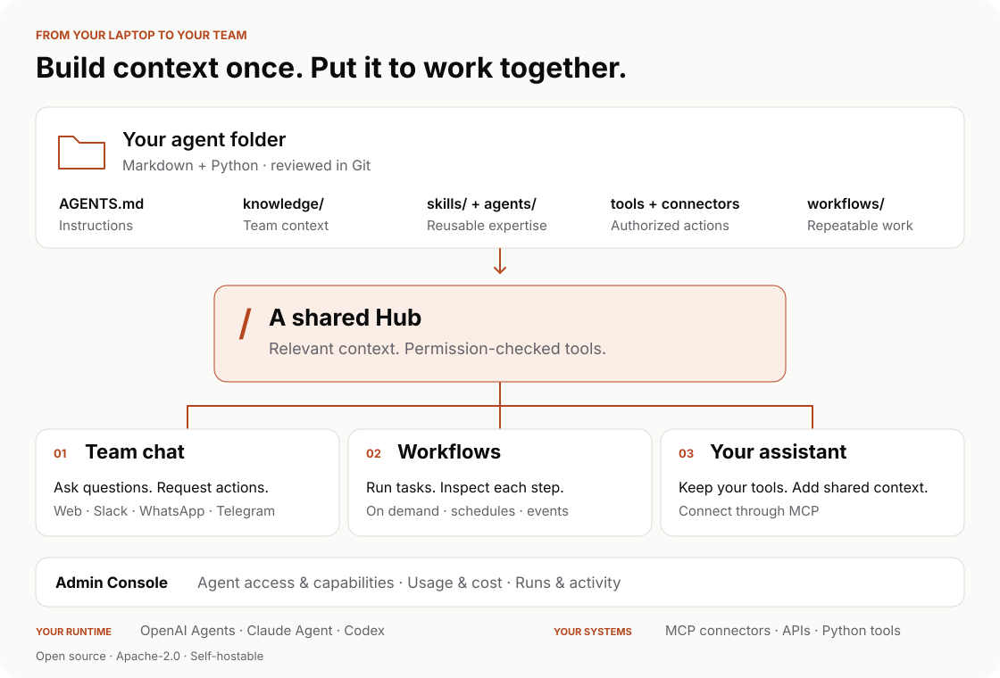

<p align="center">
  <picture>
    <source media="(prefers-color-scheme: dark)" srcset="portal/src/assets/brand/wordmark-dark.png">
    
  </picture>
</p>

<h3 align="center">One brain for your internal agents.</h3>
<p align="center">Provide context once. Reuse it across workflows, chat, and the AI tools your team already uses.</p>
<p align="center">
  <a href="https://hubzoid.com/docs">Documentation</a> ·
  <a href="docs/quickstart.md">Quickstart</a> ·
  <a href="https://hubzoid.com">Website</a> ·
  <a href="CONTRIBUTING.md">Contribute</a>
</p>
<p align="center">
  <a href="https://pypi.org/project/hubzoid/"></a>
  <a href="LICENSE"></a>
</p>

<p align="center">
  <picture>
    <source media="(prefers-color-scheme: dark)" srcset="assets/shared-hub-dark.svg">
    
  </picture>
</p>

Hubzoid helps builders turn a useful personal agent into something their team can use. A **Hub** holds instructions, knowledge, skills, tools, and agent definitions in a versionable folder. Workflows, team chat, and supported assistants reuse the relevant parts under the hub's access rules.

Start on your laptop. Add the context and capabilities your team needs. Bring the hub to a shared deployment when you are ready to manage accounts, permissions, and ongoing operation.

## Start a hub

Use **Python 3.11 or 3.12** in a virtual environment. Fresh interactive setup detects signed-in Claude or Codex CLIs and saves your choice. Without a selection, the default remains `claude-local`. Prefer an API provider? Configure a model and key in `my-hub/.env` before running. See [providers](docs/providers.md).

```bash
python3.12 -m venv .venv
source .venv/bin/activate
pip install hubzoid
hubzoid init my-hub
hubzoid run my-hub
```

Open [localhost:3080](http://localhost:3080), select your agent, and try **“Say hello using the hello skill.”** The minimal template includes a skill, knowledge file, custom tool, and sub-agent you can inspect and change. Edit `my-hub/AGENTS.md` to make the hub yours.

The default is local single-user mode. For a shared deployment, enable authentication and configure the intended owner before exposing the public port. See [administration](docs/ADMINISTRATION.md). This branch's changes may be ahead of the package published on PyPI; [source installation](docs/quickstart.md#run-this-checkout) tests the checked-out revision.

## Your context is worth keeping

The terminology, the decisions, the way your team checks a report—this is the
context that makes an agent useful. Keep it alongside reusable skills and tools
in a Hub instead of copying it into every prompt or rebuilding it for each chat
surface. Update the source files as the team learns, review them in Git, and
reuse the relevant parts wherever the work happens.

Business data can stay in its source systems. Connect it through Python tools or
MCP, and grant the capabilities each person needs. Shared context does not mean
shared credentials or unrestricted access.

## One hub, three ways to work

| Experience | Use it for | Start here |
|---|---|---|
| **Chat** | Ask questions and take authorized actions using the hub's context | [Web and account setup](docs/auth.md), [Slack](docs/slack.md), [other channels](docs/inbound-surfaces.md) |
| **Workflows** | Repeatable work with recorded runs, steps, schedules, and recovery. Each run acts as an ordinary account and can publish a private report and email that person a link. | [Markdown tasks](docs/schedule.md), [Python workflows](docs/workflows.md), [Who a workflow runs as](docs/workflow-identity.md), [Reports and email](docs/reports-and-email.md) |
| **Your assistant through MCP** | Bring hub tools, knowledge, and skills into a supported personal assistant | [Connect an MCP client](docs/mcp-server.md) |

These experiences share a foundation. Conversation history, workflow state, and permissions remain distinct. Each integration has its own setup and supported capabilities.

```text
my-hub/
├── AGENTS.md        Main agent instructions
├── knowledge/       Reference material
├── skills/          Reusable instructions, loaded when needed
├── agents/          Specialist agent definitions
├── tools_local/     Python tool factories
├── restricted/      Tools that require explicit permissions
├── connectors/      External MCP connections
├── schedule/        Markdown tasks
├── workflows/       Python workflows and steps
└── evals/           Behavioural checks
```

Only `AGENTS.md` is required for the hub structure. Runtime credentials and configuration still need to be set. Start small and add files when they become useful. [Author a hub →](docs/authoring-a-hub.md)

## Start with work your team already does

A useful Hub begins with a specific job. These are examples you can build with
hub knowledge, tools and workflows; connecting your real systems is part of setup.

| Job | In the Hub | How the team uses it |
|---|---|---|
| **Morning operations briefing** | Reporting definitions, source connectors, a briefing skill and a scheduled workflow | Read the saved result, then ask follow-up questions in chat |
| **Supplier or inventory checks** | Matching rules, authorized data tools and an exception-checking workflow | Inspect the run and investigate exceptions using the same definitions |
| **Team knowledge assistant** | Policies, terminology and reusable skills | Ask in chat or bring the Hub into a personal assistant through MCP |
| **Engineering support** | Project context, review instructions and issue-system tools | Use the shared context from a supported coding assistant |

For example, a purchasing Hub can define what counts as an overdue order once.
A workflow produces the daily report; a teammate asks which suppliers need
attention; a personal assistant uses the authorized reporting tools while drafting
a follow-up. Each experience uses the same maintained definition, with access
checked for the caller.

## From your laptop to your team

- **Keep context in files.** Review changes in Git and maintain the knowledge the agent relies on.
- **Connect existing systems.** Use MCP connectors, user-owned connections, or Python tools. Keep credentials separate from agent-readable material.
- **Grant capabilities deliberately.** The Admin Console manages agent entry and restricted tools. Enforcement happens outside the model, with recorded allow and deny decisions.
- **Inspect what ran.** View usage, workflow results, steps, people, and activity. Estimated model cost is guidance; your provider's bill is authoritative.
- **Choose a runtime.** Hubzoid supports OpenAI Agents, Claude Agent and local Codex backends. Provider and channel capabilities vary; use the [provider guide](docs/providers.md) for the supported paths.
- **Operate one or several hubs.** Run one hub or use `hubzoid gateway` for a shared chat app and deployment. Back up before upgrades and verify access with ordinary user accounts.

Open WebUI supplies chat and account authentication. Hubzoid's Admin Console supplies access management and execution inspection at `/portal/`. Administrators see an **Admin Console** link above their profile in the chat sidebar (an icon when collapsed). There is one account system. With public sign-up closed by default, an
administrator creates login accounts in Open WebUI and grants agent access in the
Admin Console. **Add person** grants permissions; it does not create a login or
send an invitation.

The dashboard brings agent cards together with messages, users, token usage,
workflow runs and approximate cost. Open an agent to manage access, inspect its
runs and schedules, or review activity. Restricted capabilities remain enforced
by Hubzoid before the tool runs, rather than by an instruction asking the model
to behave.

## Try a worked example

```bash
# Guided chat tour
hubzoid init guided-hub --template demo

# Workflow example with bundled metrics
hubzoid init watchtower --template watchtower
```

The [template catalog](templates/README.md) also has examples for briefings, accounts, supplier checks, inventory, Q&A, and operations. Examples use sample data and placeholder integrations where stated. Inspect their README before connecting real systems or enabling schedules.

For a small Python workflow:

```bash
hubzoid new workflow first-check my-hub
hubzoid schedule run my-hub first_check
```

The scaffold runs on demand and needs no model or external service. Add a schedule only when you want unattended execution. The Console inspects runs; CLI commands operate them.

## Documentation

The [website documentation](https://hubzoid.com/docs) is the reading and discovery surface. The guides in this checkout describe this revision and remain available when working offline or reviewing a change.

| Task | Guide in this repository |
|---|---|
| Install and get a first useful reply | [Quickstart](docs/quickstart.md) |
| Choose models and credentials | [Providers](docs/providers.md) |
| Build tools, knowledge, and skills | [Hub authoring](docs/authoring-a-hub.md) |
| Set up people and capabilities | [Administration](docs/ADMINISTRATION.md), [access management](docs/access-management.md) |
| Automate and inspect work | [Markdown tasks](docs/schedule.md), [Python workflows](docs/workflows.md) |
| Connect an assistant | [MCP server](docs/mcp-server.md) |
| Deploy, upgrade, and recover | [Deployment](docs/DEPLOYING.md), [upgrading](docs/UPGRADING.md), [backup](docs/BACKUP.md) |
| Test behaviour and observe calls | [Evals](docs/evals.md), [observability](docs/OBSERVABILITY.md) |

[Browse all guides →](docs/README.md)

## Contribute

Read [CONTRIBUTING.md](CONTRIBUTING.md) and the [product direction](docs/PRODUCT_CONTEXT.md). Propose non-trivial changes as text in `proposals/` before large implementations. Keep integration and maintenance costs low; preserve the hub-folder contract and runtime neutrality.

```bash
pip install -e '.[dev]'
pytest
```

Real-provider tests are separate and skip without credentials. Changes to the Console also require its build and browser checks. See [the contributor guide](CONTRIBUTING.md).

## License and help

Hubzoid product code, including team controls, is **Apache-2.0 licensed**. Dependencies, optional services, fonts, and brand assets retain their own terms. See [LICENSE](LICENSE) and [LICENSING.md](LICENSING.md).

Need help building or operating your team's agent? [Implementation assistance](https://hubzoid.com/enterprise) uses the same open-source product.
