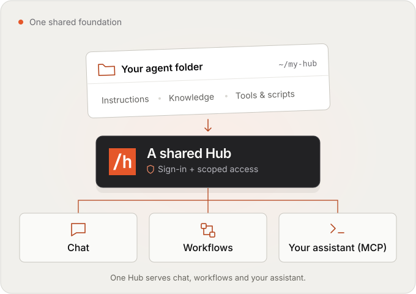

<p align="center">
  <picture>
    <source media="(prefers-color-scheme: dark)" srcset="portal/src/assets/brand/wordmark-dark.png">
    
  </picture>
</p>

<h3 align="center">One brain for your internal agents.</h3>
<p align="center">Provide context once. Reuse it across workflows, chat, and the AI tools your team already uses.</p>
<p align="center">
  <a href="https://hubzoid.com/docs">Documentation</a> ·
  <a href="docs/quickstart.md">Quickstart</a> ·
  <a href="https://hubzoid.com">Website</a> ·
  <a href="CONTRIBUTING.md">Contribute</a>
</p>
<p align="center">
  <a href="https://pypi.org/project/hubzoid/"></a>
  <a href="LICENSE"></a>
</p>

**Hubzoid is an open-source, self-hostable platform for internal AI agents.**
Keep your team's knowledge, instructions, skills, and tools in a versionable
folder. Use that shared Hub through chat, repeatable workflows, or your own
assistant through MCP.

Start with a useful agent on your laptop. Give it the context and capabilities
it needs, then share it with your team using accounts and scoped permissions.

<p align="center">
  
</p>

## Start a hub

Use **Python 3.11 or 3.12** in a virtual environment. Fresh interactive setup detects signed-in Claude or Codex CLIs and saves your choice. Without a selection, the default remains `claude-local`. Prefer an API provider? Configure a model and key in `my-hub/.env` before running. See [providers](docs/providers.md).

```bash
python3.12 -m venv .venv
source .venv/bin/activate
pip install hubzoid
hubzoid init my-hub
hubzoid run my-hub
```

**Workflows on Python 3.12:** the workflow engine (DBOS, which runs markdown
schedules and code workflows) needs SQLite 3.42 or newer, or PostgreSQL.
Check with the same Python the hub uses:
`python -c "import sqlite3; print(sqlite3.sqlite_version)"`.
`hubzoid doctor` reports it as `deps.sqlite`. Python 3.11 is not affected.

Open [localhost:3080](http://localhost:3080), select your agent, and try **“Say hello using the hello skill.”** The minimal template includes a skill, knowledge file, custom tool, and sub-agent you can inspect and change. Edit `my-hub/AGENTS.md` to make the hub yours.

The default is local single-user mode. For a shared deployment, enable authentication and configure the intended owner before exposing the public port. See [administration](docs/ADMINISTRATION.md). This branch's changes may be ahead of the package published on PyPI; [source installation](docs/quickstart.md#run-this-checkout) tests the checked-out revision.

## One hub, three ways to work

| Experience | Use it for | Start here |
|---|---|---|
| **Chat** | Ask questions and take authorized actions using the hub's context | [Web and account setup](docs/auth.md), [Slack](docs/slack.md), [other channels](docs/inbound-surfaces.md) |
| **Workflows** | Run scheduled reports and checks, inspect their steps, and save the results | [Markdown tasks](docs/schedule.md), [Python workflows](docs/workflows.md), [reports and email](docs/reports-and-email.md) |
| **Your assistant through MCP** | Bring hub tools, knowledge, and skills into a supported personal assistant | [Connect an MCP client](docs/mcp-server.md) |

Business data can stay in its source systems, connected through tools or MCP.
Shared context does not mean shared credentials: conversation history, workflow
state, and permissions remain distinct. Each integration has its own setup.

## A hub is a folder

```text
my-hub/
├── AGENTS.md        Main agent instructions
├── knowledge/       Reference material
├── skills/          Reusable instructions, loaded when needed
├── agents/          Specialist agent definitions
├── tools_local/     Python tool factories
├── restricted/      Tools that require explicit permissions
├── connectors/      External MCP connections
├── schedule/        Markdown tasks
├── workflows/       Python workflows and steps
└── evals/           Behavioural checks
```

Only `AGENTS.md` is required for the hub structure. Runtime credentials and configuration still need to be set. Start small and add files when they become useful. [Author a hub →](docs/authoring-a-hub.md)

## Start with a useful job

| Example | What it does | Try it |
|---|---|---|
| **AskHub** | Answer team questions from shared knowledge | [Company Q&A template](templates/company-qna) |
| **Daily Reports** | Prepare a recurring briefing from business inputs | [Morning briefing template](templates/morning-briefing) |
| **Watchtower** | Check bundled metrics against thresholds and explain exceptions | `hubzoid init watchtower --template watchtower` |

Examples use sample data and placeholder integrations where stated. Read the
example's instructions before connecting real systems or enabling schedules.
[Browse all templates →](templates/README.md)

## Share it with your team

- **Connect existing systems.** Add Python tools and MCP connections. Keep
  credentials separate from agent-readable files.
- **Control who can do what.** Grant agent access and restricted capabilities
  in the Console. Hubzoid checks permissions before a restricted tool runs.
- **See what happened.** Inspect workflow runs, steps, usage, and activity.
  Model cost estimates are guidance; your provider's bill is authoritative.
- **Choose your runtime.** Use OpenAI Agents, Claude Agent SDK, or local Codex.
  Provider and channel capabilities vary. See [providers](docs/providers.md).
- **Run it yourself.** Deploy one hub, or use `hubzoid gateway` to serve several
  hubs through a shared chat app. See [deployment](docs/DEPLOYING.md).

Open WebUI provides chat and account authentication. Hubzoid's **Console** at
`/portal/` manages access and shows execution details, using the same accounts.
Administrators can open it from the **Admin Console** link in the chat sidebar.
For adding teammates, Google sign-in, permissions, and shared deployment setup,
see [administration](docs/ADMINISTRATION.md).

## Try a worked example

```bash
# Guided chat tour
hubzoid init guided-hub --template demo
```

For a small Python workflow:

```bash
hubzoid new workflow first-check my-hub
hubzoid schedule run my-hub first_check
```

The scaffold runs on demand and needs no model or external service. Add a schedule only when you want unattended execution. The Console inspects runs; CLI commands operate them.

## Documentation

The [website documentation](https://hubzoid.com/docs) is the reading and discovery surface. The guides in this checkout describe this revision and remain available when working offline or reviewing a change.

| Task | Guide in this repository |
|---|---|
| Install and get a first useful reply | [Quickstart](docs/quickstart.md) |
| Choose models and credentials | [Providers](docs/providers.md) |
| Build tools, knowledge, and skills | [Hub authoring](docs/authoring-a-hub.md) |
| Set up people and capabilities | [Administration](docs/ADMINISTRATION.md), [access management](docs/access-management.md) |
| Automate and inspect work | [Markdown tasks](docs/schedule.md), [Python workflows](docs/workflows.md) |
| Connect an assistant | [MCP server](docs/mcp-server.md) |
| Deploy, upgrade, and recover | [Deployment](docs/DEPLOYING.md), [upgrading](docs/UPGRADING.md), [backup](docs/BACKUP.md) |
| Test behaviour and observe calls | [Evals](docs/evals.md), [observability](docs/OBSERVABILITY.md) |

[Browse all guides →](docs/README.md)

## Contribute

Read [CONTRIBUTING.md](CONTRIBUTING.md) and the [product direction](docs/PRODUCT_CONTEXT.md). Propose non-trivial changes as text in `proposals/` before large implementations. Keep integration and maintenance costs low; preserve the hub-folder contract and runtime neutrality.

```bash
pip install -e '.[dev]'
pytest
```

Real-provider tests are separate and skip without credentials. Changes to the
Console also require its build and browser checks. CI runs when a GitHub release
is published, so run the relevant checks locally before pushing. See
[contributing](CONTRIBUTING.md) and [publishing a release](docs/RELEASING.md).

## License and help

Hubzoid product code, including team controls, is **Apache-2.0 licensed**. Dependencies, optional services, fonts, and brand assets retain their own terms. See [LICENSE](LICENSE) and [LICENSING.md](LICENSING.md).

Need help building or operating your team's agent? [Implementation assistance](https://hubzoid.com/enterprise) uses the same open-source product.
