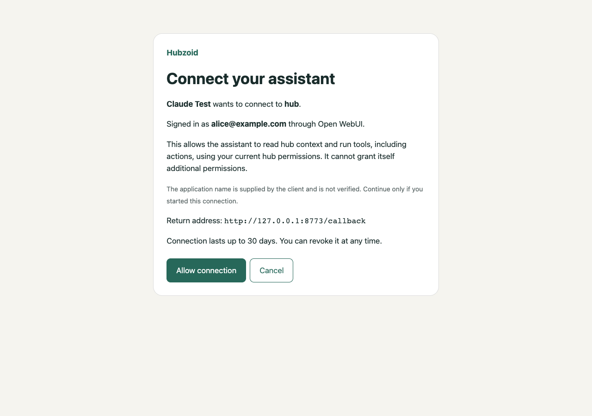

# MCP OAuth implementation verification

Branch: `feat/mcp-oauth-minimal`, based on `43babc3`.

## Delivered

- Opt-in FastMCP OAuth provider with existing Open WebUI login and explicit Hubzoid consent.
- Durable, hashed opaque tokens; single-use authorization codes; S256 PKCE;
  mandatory resource binding; rotating refresh tokens and grant revocation.
- Legacy, dual and OAuth-only modes; legacy remains the default.
- Single-hub and per-hub gateway discovery/authorization routes.
- Member consent and connection-management pages, with CSRF/origin checks.
- Local Claude Code plugin template and deployment/connection instructions.
- Additive operational migration; no new runtime dependency or external identity service.

## Verification evidence

- Original MCP baseline: 25 tests passed before changes.
- Final focused MCP/OAuth/gateway suite: 67 passed.
- Migration suite: 10 passed, including SQLite and PostgreSQL simultaneous startup.
- Chrome on loopback with synthetic accounts: real consent POST, external callback,
  token exchange and authenticated tools/list succeeded; browser revocation immediately
  changed MCP access from HTTP200 to HTTP401. No console errors. Screen checked at
  widths1280 and320, without horizontal overflow.
- `claude plugin validate ./plugins/claude/hubzoid`: passed.
- Wheel build succeeded. Archive contains all three OAuth modules and `op_0008` migration.
- `git diff --check`: passed.

Full regression results are recorded at completion below. Live-model/browser E2E
markers are excluded from the offline regression command. An initial unfiltered
`pytest` attempt entered unrelated live-model tests and was interrupted; a sandboxed
offline run could not bind sockets for temporary databases and mock services.
These are not reported as a green full suite.

## Independent review and fixes

A separate read-only reviewer found three important issues, now fixed:

1. `no-referrer` caused Chrome to send `Origin:null`, breaking CSRF validation.
   Browser reproduction failed before the fix and succeeded with `same-origin`.
2. Consent's CSP needed to permit the validated callback origin on its POST redirect
   chain. The external Chrome callback now completes without widening other pages.
3. Raw public URL casing/default ports disagreed with the SDK's canonical discovery
   values. URL canonicalization is now shared by resource, origin and storage.
   The regression test failed before the fix and passed afterward.

Gateway configuration also rejects an MCP URL whose path differs from that hub's
actual slug. The PostgreSQL reset fixture now includes the new OAuth table; its
previous omission caused migration tests to reuse a stale table.

## Decisions and practical limits

- Use the installed OAuth provider SDK instead of a new external identity service:
  lower deployment overhead; Hubzoid now owns and must maintain provider storage,
  consent and resource-binding logic.
- Use one `hub:access` scope: preserves existing permissions and honestly includes
  actions; it does not offer a separately enforced read-only grant.
- Keep ingress rate/request-size limits at the existing reverse proxy: operators
  must configure them before making registration publicly reachable.
- Real Claude-account verification requires the deployed HTTPS service and remains
  an operator smoke test. Local HTTP/browser tests do not establish that external
  account integration or marketplace distribution is complete.
- The reviewer's PostgreSQL concurrency inspection was static; the reviewer exercised
  token refresh contention on SQLite. Automated migration tests do exercise PostgreSQL.
- This release contains a Claude Code plugin template. A separate OpenAI/Codex package
  and publishing to either marketplace are not included.

## Deferred minor test improvements

- The committed test named for cross-resource behavior currently checks discovery;
  the reviewer separately verified actual shared-store token isolation.
- The committed `asyncio.gather` code-reuse test does not create simultaneous database
  transactions because provider methods are synchronous. The reviewer separately
  exercised synchronized two-thread refresh replay: one exchange won and the replay
  revoked that grant, including the winning exchange's access token.

## Consent screen



## Final regression gate

```sh
python -m pytest -q -m 'not e2e and not e2e_llm and not e2e_ui and not e2e_browser'
```

**2,573 passed, 15 skipped, 36 deselected, 20 warnings; exit code 0.**
The warnings are existing MCP client deprecations in OWUI/workflow parity tests.
The final run includes the browser-header/configuration fixes and the corrected
migration reset fixture. Runtime: 14m56s. No real Claude-account connection,
production deployment, public plugin publication, or git push was performed.
